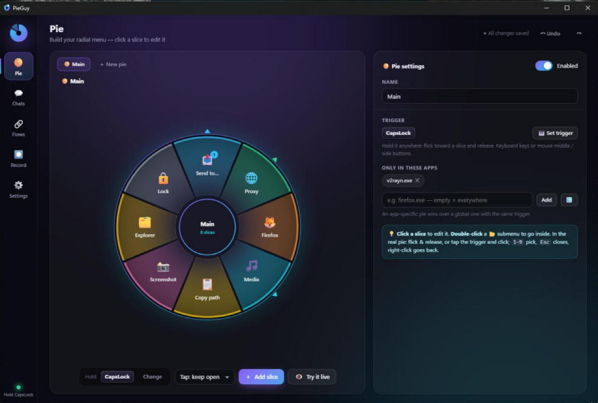

# 🥧 PieGuy

A radial pie menu for Windows that works in every app. Hold a key, flick toward a slice, and release. Each slice can run anything from one shortcut to a multi-step automation (proxy → Firefox → Telegram → send file).

## Setup — make it a real app (once)

1. Install **Python 3.10+** (only needed for building).
2. Double-click **`build.bat`**. It:
   - builds **`dist\PieGuy\PieGuy.exe`**, a **portable** app folder (no Python needed to run it)
   - copies over your current settings
   - adds **Desktop + Start-menu shortcuts**
   - starts PieGuy and turns on **Start with Windows**

**Portable:** the whole `dist\PieGuy` folder is the app, and your settings live inside it (`data\`). You can move it anywhere. The startup entry re-points itself to the new location on the next launch. To uninstall, turn off *Start with Windows* and delete the folder.

Run `build.bat` again after changing the code to rebuild (settings are kept). You can still run from source with `install.bat` / `PieGuy.bat`.

## Using the pie

| Do this | Result |
|---|---|
| **Hold CapsLock** (default), flick toward a slice, release | Runs the slice |
| Flick past the edge of a slice that has an arrow ▸ (or hover on it briefly) | Opens its sub-pie at the cursor |
| **Tap** CapsLock | The menu stays open: click a slice, or press `1`–`9` |
| `Esc` / right-click / `Backspace` | Close / go back |

You can change the trigger to any key, a key combo, or the middle or side mouse buttons. Each pie has its own trigger, so you can have several pies. A pie can also be limited to specific apps.

## Send a file to a Telegram chat (the built-in flow)

1. **Chats page → Add chat.** Give it a name and either the `@username` or the Telegram Web address-bar URL (private chats look like `web.telegram.org/k/#123456789`).
2. Select a file in Explorer (or copy it), hold CapsLock → **Send to…** → pick the chat.
3. The flow **"Send file via Telegram Web"** then:
   - takes the file (**Explorer selection → copied file → asks you**)
   - starts v2rayN and sets the **system proxy**, then waits until the proxy port is actually up
   - opens the chat in **Firefox** (reusing an open Telegram tab), pastes the file and presses **Send**

The chats you used most recently appear first in the sub-pie. You can edit any step: swap the proxy step for TUN mode, add a caption, remove auto-send, and so on.

> Needs Firefox 116+ (it added pasting of OS-copied files). If a chat page loads slowly, raise *Page load wait* in the Telegram Web step.

### v2rayN notes
- **Proxy ON** starts v2rayN if needed and sets the Windows system proxy to `127.0.0.1:<its port>` (read from `guiConfigs\guiNConfig.json`, default 10808). It does this directly, without clicking anything in v2rayN.
- **TUN ON/OFF** restarts v2rayN with `EnableTun` switched in its config. TUN mode needs admin, so Windows shows a UAC prompt.
- If auto-detect can't find v2rayN, open v2rayN once, then press *Settings → v2rayN.exe → Detect*.

## Recording

**Record page → ● (big red button)**. Do the task, then press **Pause** or click the red pill to stop. While recording:
- **A glowing box follows your mouse** around the exact button, field, menu item or dropdown entry PieGuy sees, with a label showing its name. It is 🟢 green when PieGuy recognizes the element, 🟡 amber when it has no name (PieGuy will use its position), and 🔴 red for an **admin app**.
- **Every click gets a ✓ ripple.** The pill at the top shows how many steps have been recorded and what the last one was.

The recording becomes steps you can edit:
- **Clicks → "Click element".** PieGuy stores *which* element you clicked. This also works for dropdown lists, right-click menus and tray menus, because PieGuy searches all of the app's popup windows during replay. Changing names like "v2rayN – 12 KB/s" are fuzzy-matched. Icon-only buttons are remembered through their nearest named parent.
- **Submenus opened by hovering** (e.g. tray menu → *System proxy ▸*) record an automatic **Hover** step.
- **Typing → clean text.** Backspaces fix the text instead of being replayed, and shortcuts become key steps.
- **Opening an app** through Start or the taskbar → one **Launch app** step. **Pauses** → **Wait** steps.

A step can also target an element directly with **🎯 Pick**, which shows the same live box.

### Admin apps (v2rayN in TUN mode, etc.)
Windows blocks normal programs from seeing or controlling apps that run **as administrator**. If v2rayN runs as admin, turn on **Settings → Run as administrator** (or tray → *Restart as administrator*). With this on:
- Recording, replaying, TUN switching and the pie itself work inside admin apps.
- Apps that PieGuy opens (Firefox, files, links) still start as your **normal** user.
- *Start with Windows* uses a scheduled task, so there's no UAC prompt at every login.

## Step types

Launch app · Open URL (in a chosen browser, can reuse a tab) · Open file or folder · Close app · Run command (CMD or PowerShell) · Focus or wait for a window · Window actions · Press keys (including media and volume keys) · Type text (Persian works) · Click element or position · Hover · Scroll · Get files (Explorer, clipboard or file picker) · Copy text or files · Copy selection · Ask for text · v2rayN · System proxy · Telegram Web · Wait · Notify · Run flow

Steps can use variables: `{files}` `{file}` `{filename}` `{clipboard}` `{date}` `{contact_url}` `{contact_name}`, plus any variable you save yourself. Each step can wait afterwards, and can be set to *skip & continue* if it fails. Ctrl+Z undoes changes in Settings.

## Files
- `data/config.json`: everything you configured (next to PieGuy.exe in the app; back it up with Export)
- `data/pieguy.log`: the log to check if something misbehaves
- `pieguy/`: app code (hooks, overlay, engine, recorder) · `ui/`: the settings interface
